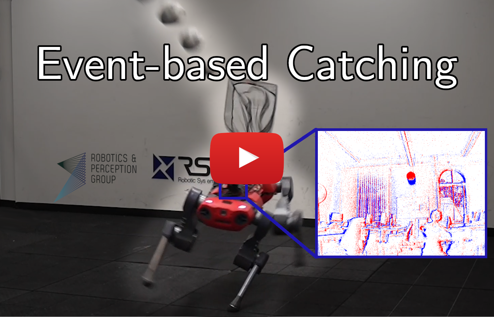
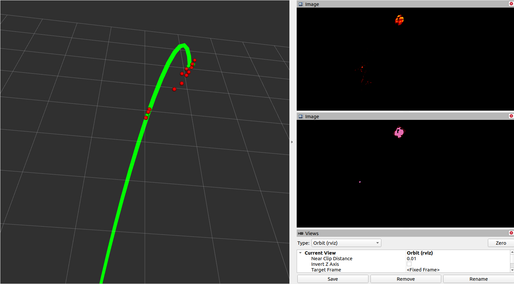

# Event-based Agile Object Catching with a Quadrupedal Robot

<p align="center">
  <a href="https://youtu.be/FpsVB8EO54M">
    
  </a>
</p>

This repository contains code that implements dynamic obstacle tracking with a DVS sensor, as described in Forrai et. al ICRA '23 (see paper [here](https://rpg.ifi.uzh.ch/docs/ICRA23_Forrai.pdf)) and Falanga et. al SciRob '20 (see paper [here](https://www.science.org/doi/10.1126/scirobotics.aaz9712)).

## Citation
If you use this code in an academic context, please cite the following works:

Benedek Forrai*, [Takahiro Miki*](https://mktk1117.github.io/), [Daniel Gehrig*](https://danielgehrig18.github.io/), [Marco Hutter](https://mavt.ethz.ch/people/person-detail.hutter.html), [Davide Scaramuzza](http://rpg.ifi.uzh.ch/people_scaramuzza.html), "Event-based Agile Object Catching with a Quadrupedal Robot", ICRA, 2023. [PDF](https://rpg.ifi.uzh.ch/docs/ICRA23_Forrai.pdf)
(* denotes equal contribution)

```bibtex
@InProceedings{Forrai_23_ICRA,
  author = {Benedek Forrai and Takahiro Miki and Daniel Gehrig and Marco Hutter and Davide Scaramuzza},
  title = {Event-based Agile Object Catching with a Quadrupedal Robot},
  booktitle = {{IEEE} International Conference on Robotics and Automation (ICRA)},
  month = {June},
  year = {2023}
}
```

[Davide Falanga](http://dfalanga.me/), [Kevin Kleber](https://www.linkedin.com/in/kevin-kleber/?originalSubdomain=ch), [Davide Scaramuzza](http://rpg.ifi.uzh.ch/people_scaramuzza.html), "Dynamic obstacle avoidance for quadrotors with event cameras", Science Robotics, 2020

```bibtex
@article{Falanga_20_SciRob,
  title={Dynamic obstacle avoidance for quadrotors with event cameras},
  author={Davide Falanga and Kevin Kleber and Davide Scaramuzza},
  journal={Science Robotics},
  volume={5},
  number={40},
  pages={eaaz9712},
  year={2020},
  publisher={American Association for the Advancement of Science}
}
```

## Installation
### Environment
This code was used on the following setup: Ubuntu 20.04 LTS (Focal) + ROS Noetic + LibOpenCV 4.2. Although you might get away with using 22.04, ROS Kinetic or later versions of LibOpenCV, the package was not tested under such circumstances.

### Install dependencies
Our repository depends on the following non-standard packages:
- [rpg_dvs_ros](https://github.com/uzh-rpg/rpg_dvs_ros)
- [rpg_quadrotor_common](https://github.com/uzh-rpg/rpg_quadrotor_common)
- [eigen_catkin](https://github.com/ethz-asl/eigen_catkin)
- [gflags_catkin](https://github.com/ethz-asl/gflags_catkin)
- [glog_catkin](https://github.com/ethz-asl/glog_catkin)

To install these in your workspace, follow the instructions below.

First, you should install and test [rpg_dvs_ros](git@github.com:uzh-rpg/rpg_dvs_ros.git). To do this, follow the instructions of the [README](https://github.com/uzh-rpg/rpg_dvs_ros#readme).

Then, you can create a `~/git` folder to which we pull all the other repos:
```bash
mkdir -p ~/git
cd ~/git

git clone git@github.com:uzh-rpg/rpg_quadrotor_common.git
git clone git@github.com:ethz-asl/eigen_catkin.git
git clone git@github.com:ethz-asl/gflags_catkin.git
git clone git@github.com:ethz-asl/glog_catkin.git
```
You should then symlink these packages to your catkin workspace (change the first line according to your workspace path)
```
catkin_workspace=~/catkin_ws
ln -s ~/git/rpg_quadrotor_common $catkin_workspace/src/.
ln -s ~/git/eigen_catkin $catkin_workspace/src/.
ln -s ~/git/gflags_catkin $catkin_workspace/src/.
ln -s ~/git/glog_catkin $catkin_workspace/src/.
```

### Clone
Clone the repo

```bash
mkdir -p ~/git
cd ~/git
git clone git@github.com:fbenedek/rpg_dynamic_obstacle_detection.git
```
Symlink it to your ROS workspace similarly to the dependencies (change the first line according to your workspace path):
```bash
catkin_workspace=~/catkin_ws
ln -s ~/git/rpg_dynamic_obstacle_detection $catkin_workspace/src/.
```

### Build the packages
Having cloned the packages, you can build them using `catkin build`:
```bash
cd $catkin_workspace
source devel/setup.bash
catkin build rpg_dynamic_obstacle_detection rpg_ransac_parabola
```
Don't forget to source your environment again before using the packages:
```bash
cd $catkin_workspace
source devel/setup.bash
```

## Testing
After building and sourcing your environment, you can test your installation by running detection on a supplied `.bag` file. To do so, you only need to launch the following `.launch` file:
```bash
cd $catkin_workspace
roslaunch rpg_dynamic_obstacle_detection test_detection_and_fitting.launch
```

This should pop up an RVIZ window showing the detections, the mean timestamp images and a visualization of the clustering similar to the following:

